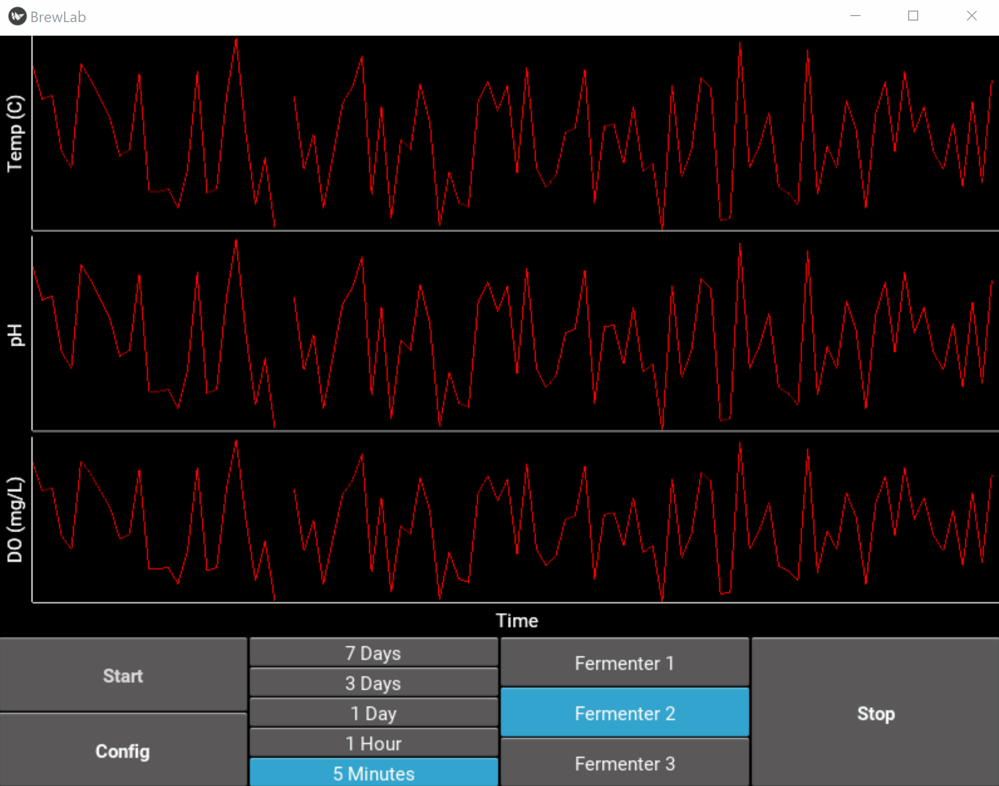

# BrewLab

This program communicates with 3 Arduino Megas for the purpose of gathering 
temperature, PH, and DO data from a batch fermenation process. Built and designed for CHBE 464.

The program can also change temperature set-points within the fermenter through the usage
of pumps attached to the fermenters. Pumps can be manually controlled via Config Screen. 

## Usage

Run the program by opening up a command line, navigate to BrewLab directory and enter:

```python main.py ```

Select the fermenters you want to use by clicking the toggle buttons in the Menu Screen. Use the sliders to set the temperature setpoint for each fermenter. Click Execute to continue.

Once in the Graphing screen, click "Start" to begin collecting data for the desired fermenters. Click a time range of data to view, and click a fermenter to select which fermenter you would like to view. 

In the Config page, you can turn a pump between AUTO/MANUAL and when in MANUAL can turn the pump ON/OFF. To adjust the temperature setpoint after starting the program, slide the slider of the fermenter to the desired temperature and click "Back". 



## Development

### macOS\Linux
1. Create a new virtual environment: `virtualenv --python=`which python3` env`
2. Activate the virtual environment: source env/bin/activate
3. Install the package in development mode: `python setup.py develop`
4. Run `garden install graph`

### Windows
1. Create a new virtual environment: `virtualenv --python=`which python3` env`
2. Activate the virtual environment: `env\Scripts\activate`
3. Install the package in development mode: `python setup.py develop`
4. Run `garden install graph`

If you don't have an Arduino to connect to for testing set enviroment variable **MODE** to "dev"

- Windows:        `set MODE=dev`
- macOS/Linux:    `export MODE=dev`

## Future Work

For future development see [Issues](https://github.com/OpenChemE/BrewLab/issues).